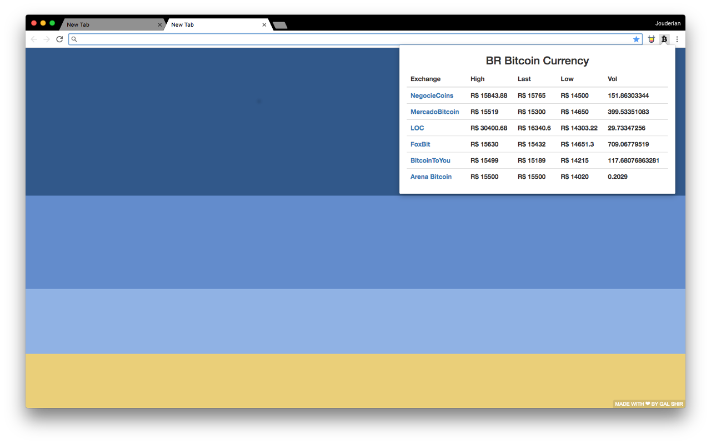

# Bitcoin BR Chrome Extension



Hey, I built this extension using Elm (:heart:) and fetching data from (BitValor)[https://bitvalor.com/api]

[Click here to use it!](https://chrome.google.com/webstore/detail/bitcoin-br/keoihaeoogphapkdoijfnfboggimfdkj?hl=pt-BR)

### Running Locally:

Clone this repo.

```
git clone https://github.com/jouderianjr/bitcoin-br-chrome-extension
```

Install all dependencies:
```
npm install
```

### Serve locally:
```
npm start
```
* Access app at `http://localhost:8080/`
* Get coding! The entry point file is `src/elm/Main.elm`
* Browser will refresh automatically on any file changes..


### Build & bundle for prod:
```
npm run build
```

* Files are saved into the `/dist` folder
* To check it, open `dist/index.html`
